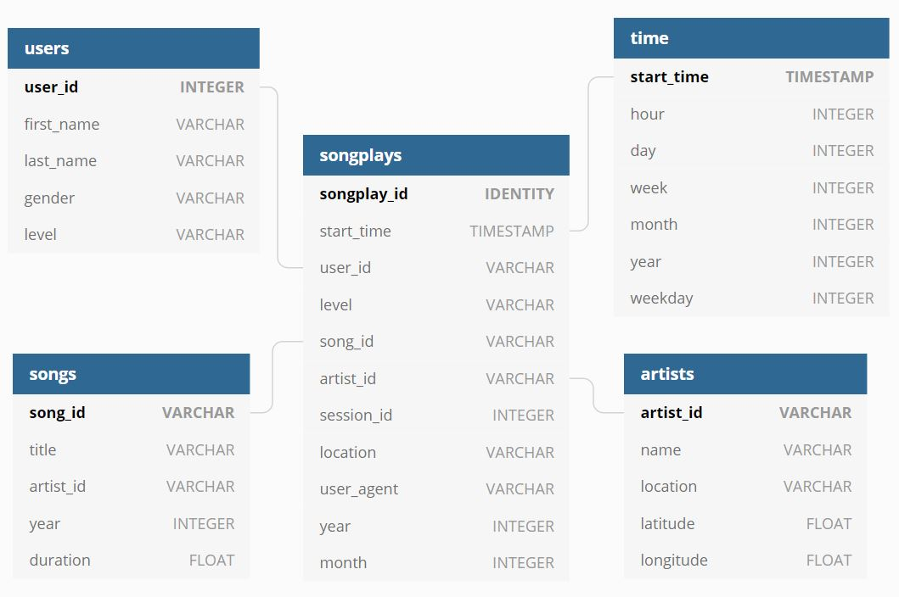

# Udacity Nano Degree Project 4: Data Lake

### Introduction
A music streaming startup, Sparkify, has grown their user base and song database even more and want to move their data warehouse to a data lake. Their data resides in S3, in a directory of JSON logs on user activity on the app, as well as a directory with JSON metadata on the songs in their app.

## Goal
The project aims to build an ETL pipeline that extracts their data from S3, processes them using Spark, and loads the data back into S3 as a set of dimensional tables. This will allow their analytics team to continue finding insights in what songs their users are listening to. The database and ETL pipeline will be tested by running queries given by the analytics team from Sparkify and compared with their expected results.

## Project Files
- etl.py: Loads JSON files from input S3 bucket, extracts and formats data, and Saves files to output S3 bucket
- dl.cfg: Configuration file containing AWS keys

## Database Schema

[dbdiagram.io](https://dbdiagram.io/d/5e0100dbedf08a25543f5ca7)

## ETL Pipeline

### Song Dataset
The first dataset is a subset of real data from the Million Song Dataset. Each file is in JSON format and contains metadata about a song and the artist of that song. The files are partitioned by the first three letters of each song's track ID. For example, here are filepaths to two files in this dataset.

`
song_data/A/B/C/TRABCEI128F424C983.json
song_data/A/A/B/TRAABJL12903CDCF1A.json
`

And below is an example of what a single song file, TRAABJL12903CDCF1A.json, looks like.
```json
{
  "num_songs": 1,
  "artist_id": "ARJIE2Y1187B994AB7",
  "artist_latitude": null,
  "artist_longitude": null,
  "artist_location": "",
  "artist_name": "Line Renaud",
  "song_id": "SOUPIRU12A6D4FA1E1",
  "title": "Der Kleine Dompfaff",
  "duration": 152.92036,
  "year": 0
}
```

### Log Dataset
The second dataset consists of log files in JSON format generated by this event simulator based on the songs in the dataset above. These simulate activity logs from a music streaming app based on specified configurations.

The log files in the dataset you'll be working with are partitioned by year and month. For example, here are filepaths to two files in this dataset.
`
log_data/2018/11/2018-11-12-events.json
log_data/2018/11/2018-11-13-events.json
`

And below is an example of what a single line of data in a log file, 2018-11-22-events.json, looks like.
```json
{
  "artist": "Dee Dee Bridgewater",
  "auth": "Logged In",
  "firstName": "Lily",
  "gender": "F",
  "itemInSession": 38,
  "lastName": "Koch",
  "length": 318.64118,
  "level": "paid",
  "location": "Chicago-Naperville-Elgin, IL-IN-WI",
  "method": "PUT",
  "page": "NextSong",
  "registration": 1541048010796.0,
  "sessionId": 818,
  "song": "La Vie En Rose",
  "status": 200,
  "ts": 1542845032796,
  "userAgent": "\"Mozilla/5.0 (X11; Linux x86_64) AppleWebKit/537.36 (KHTML, like Gecko) Ubuntu Chromium/36.0.1985.125 Chrome/36.0.1985.125 Safari/537.36\"",
  "userId": "15"
}
```

## How to run

1. Open cl.cfg
2. Under [AWS] section, enter the KEY and SECRET 
3. Open execute.ipynb
4. Execute step "Run elt.py"
